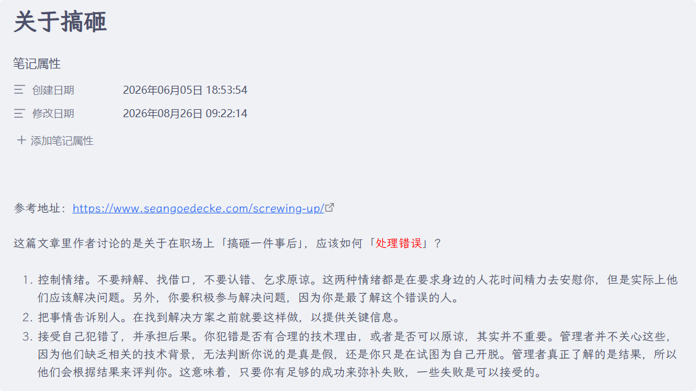
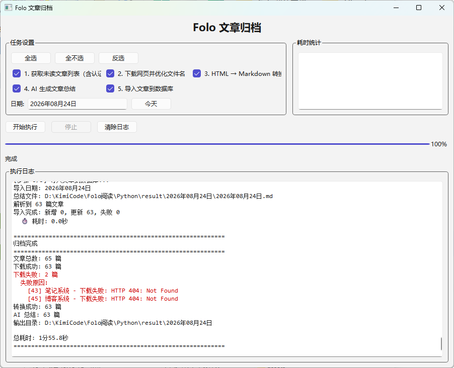

## 项目背景

很久以前就一直使用 Folo 去订阅各种频道 —— 少数派、36氪、个人博客等，这种在线浏览的方式很方便，但我仍然想将我订阅的内容保存到本地。

在此之前我碰到最大的问题在于，我是在「刷」内容，看完之后就忘记了。我最开始的做法是写笔记进行总结归纳记录，并在笔记的开头标注原文地址。

后来我时不时就发现有链接失效，可能是原作者删除了，或者平台因为某些原因下架了。于是我就打算将我订阅的内容都保存在本地，并使用卡帕西的 LLM 知识库的方法对自己读过的内容进行整理。

1. 获取 Folo 中订阅的未读列表
2. 下载原始网页
3. 转换为 markdown 文档
4. AI 内容摘要
5. 导入数据库用于搜索相关文章

代码上传在这里：[FoloArchive](https://github.com/ZerosZhang/FoloArchive)

## 项目更新记录

### 2026年08月26日

由于这篇文章是后补的，因此前期有很多更新都在此合并到一起说了。

1. 优化界面的实现，使日志块占用更多的空间
2. 同时支持 CLI 和 GUI 形式的使用方式