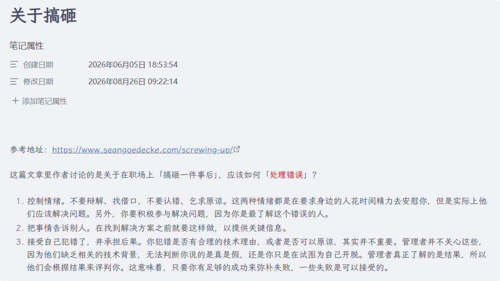
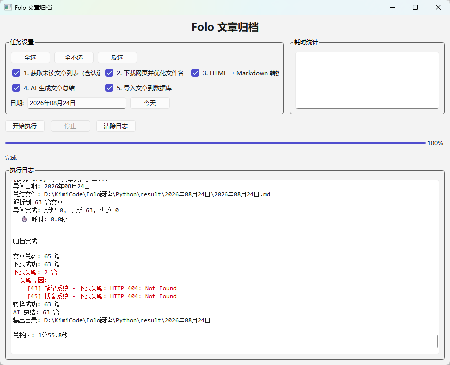
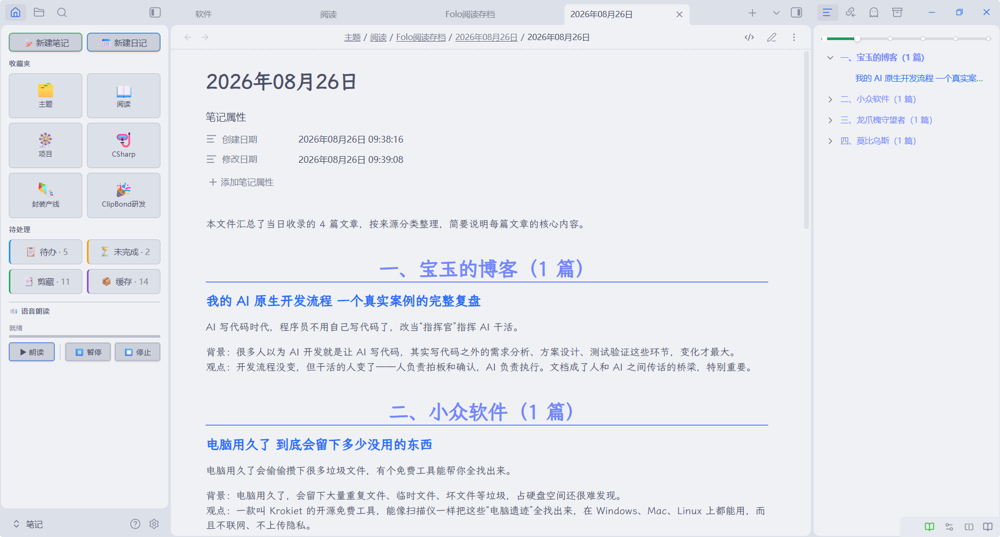
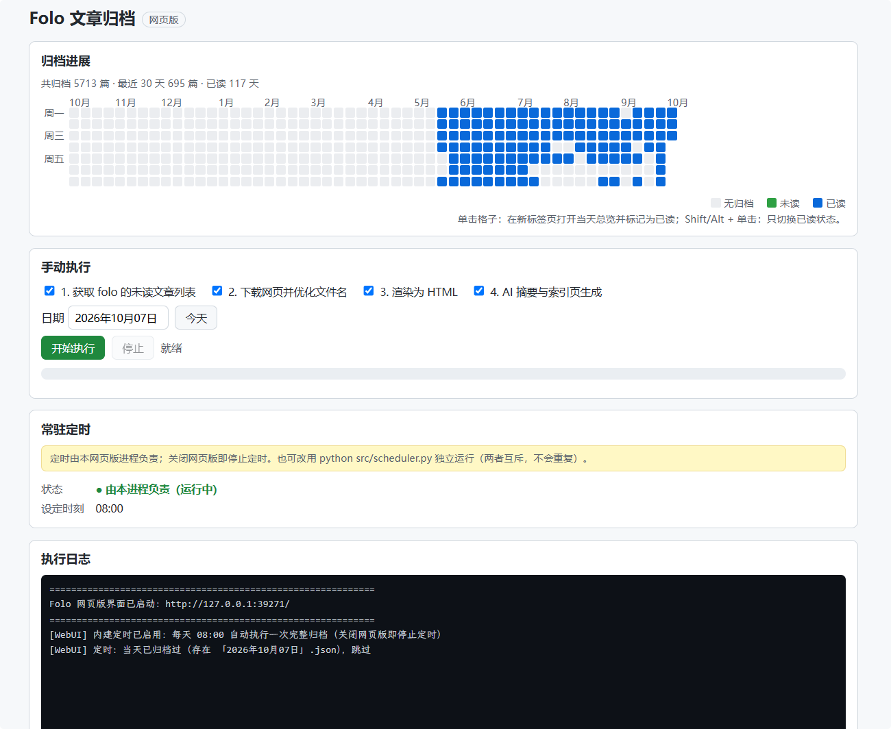
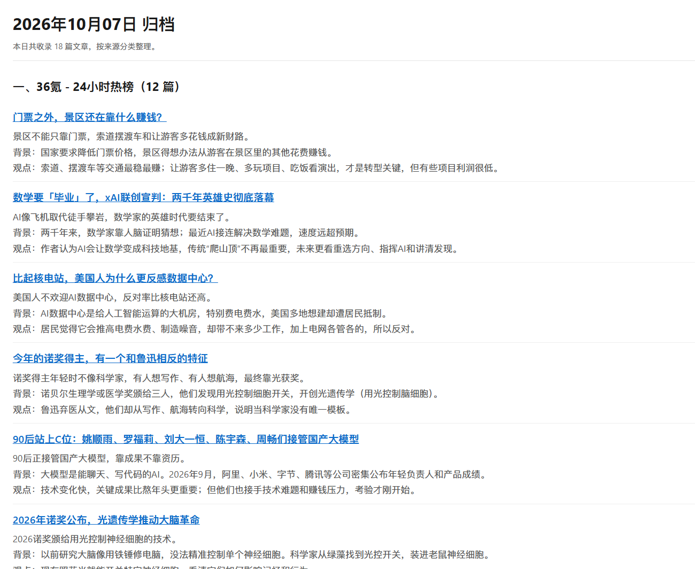

## 项目背景

很久以前就一直使用 Folo 去订阅各种频道 —— 少数派、36氪、个人博客等，这种在线浏览的方式很方便，但我仍然想将我订阅的内容保存到本地。

在此之前我碰到最大的问题在于，我是在「刷」内容，看完之后就忘记了。我最开始的做法是写笔记进行总结归纳记录，并在笔记的开头标注原文地址。

后来我时不时就发现有链接失效，可能是原作者删除了，或者平台因为某些原因下架了。于是我就打算将我订阅的内容都保存在本地，并使用卡帕西的 LLM 知识库的方法对自己读过的内容进行整理。

1. 获取 Folo 中订阅的未读列表
2. 下载原始网页
3. 转换为 markdown 文档
4. AI 内容摘要
5. 导入数据库用于搜索相关文章

代码上传在这里：[FoloArchive](https://github.com/ZerosZhang/FoloArchive)

## 项目更新记录

### 2026年08月26日

由于这篇文章是后补的，因此前期有很多更新都在此合并到一起说了。

1. 优化界面的实现，使日志块占用更多的空间
2. 同时支持 CLI 和 GUI 形式的使用方式

### 2026年10月07日

对整个项目进行了重写。

之前是将 Folo 中的订阅保存为 Markdown 文档，并手动复制到 Obsidian 中。但是几个月使用下来，发现以下问题：

1. 由于附件中图片很多，导致 Obsidian 仓库急速膨胀，每天都会增加 300MB 左右
2. 当前的代码放置在我公司的电脑上，每天上班时手动归档并复制，然后进行阅读，这导致国庆假期间的远程操作和同步有点麻烦。

因此我对整个项目进行了重写（基于 AI），主要的更新是使用 html 代替 markdown。

现在整个项目都被部署在 Windows Server 上，这台设备由于一直要运行 [RewardsAutoMate](../RewardsAutoMate/)，因此不会关机。在公司电脑上使用网页端访问局域网服务的形式，对归档的内容进行访问。这样做了之后，每天定时自动执行归档程序，我不用再记着这个事了。哪怕哪天忘记了也没问题，以天为单位做了未读/已读处理。另外也不用折腾 Obsidian 同步的问题了，内容直接存放在 Windows Server 上，不需要同步。

目前仍有以下问题没有解决：

1. 查看归档内容仍然要远程公司电脑。我考虑将内容都上传到 NAS 上，但是飞牛对 html 和 markdown 的渲染能力都不是很好
2. 失去了手动编辑的功能。之前在 Obsidian 中以 markdown 的形式存档，可以对文档进行编辑和引用，现在不行。这个问题在这几个月的使用中我认为并不重要。

