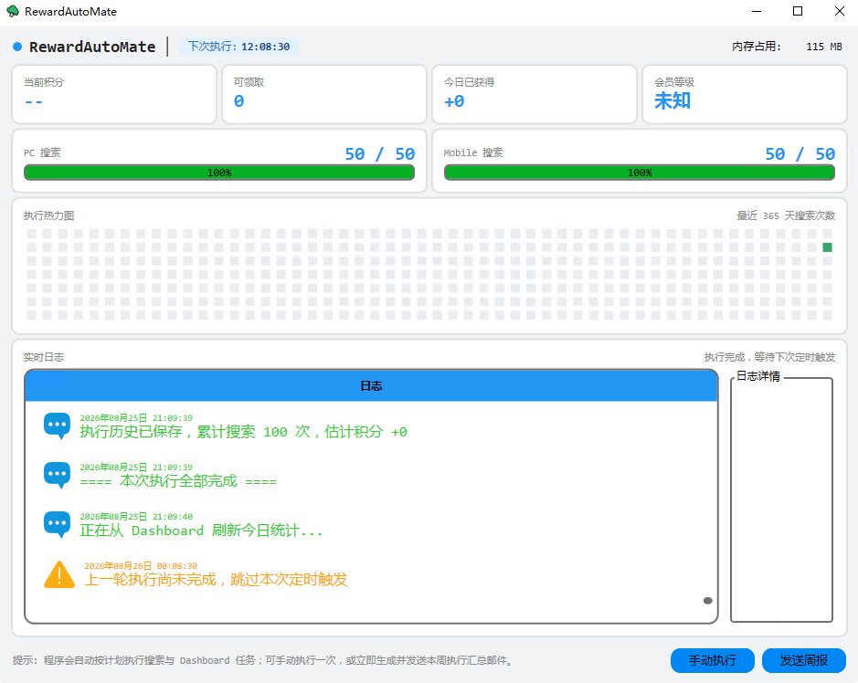

## 关于 Microsoft Rewards

`Microsoft Rewards` 是微软出品的一款软件，可以通过搜索 `Bing` 来获取奖励，奖励的种类有很多，包括现金、积分、礼品等。但是我老是忘记搜索 `Bing`，因此就实现了一个软件，帮助我每天自动搜索 `Bing`。

我并没有将该功能添加到 `ZerosTodo` 中，因为我并不希望该功能影响我正常使用电脑，所以我拿了一个老笔记本安装了 `Windows Server 2016`，当作我的服务器。

另外，`Rewards` 也有手机端的搜索任务，但是手机我是随身带着，所以我并没有实现安卓端的软件，直接使用油猴脚本进行替代。

项目代码上传到此处：[RewardsAutoMate](https://github.com/ZerosZhang/Micorosoft-Rewards)

## 功能说明

### 自动搜索功能

该软件用于在 PC 端获取随机的搜索关键词，自动搜索 `Bing`，每天搜索 40 次，每隔 12 个小时执行一次任务。如果当天已经完成了任务，则不会继续执行。

### 热力图功能

为了记录每天的搜索情况，该软件会生成如 `Github` 的热力图，用于记录每天的搜索情况。

### 自动登录功能

`Rewards` 和微软账号相关，所以在打开 `EdgeDriver` 时，要调用本地的账户信息进行登录。

## 更新记录

### 2025年04月18日

通过 `UserAgent` 伪装成移动设备，这样可以在电脑端模拟移动端的搜索。

### 2025年06月13日

Edge老是在后台自动更新，导致我时不时的要同步更新 drive 的版本，我换成 Chrome 了。

### 2025年10月26日

🥲我决定关闭这个项目，这奖励太蚊子腿了，抽奖也是完全抽不中的说。

### 2026年06月08日

用 AI 重新写了整个项目，反正不是什么特别重要的项目，代码质量无所谓了。

### 2026年08月26日

再一次用 AI 重写了，这次引入了  控件库。

1. 针对 Edge 浏览器的自动更新机制，实现了自动下载对应版本驱动的问题。
2. 每周定期发送周报邮件
3. 出现异常时发送邮件通知

